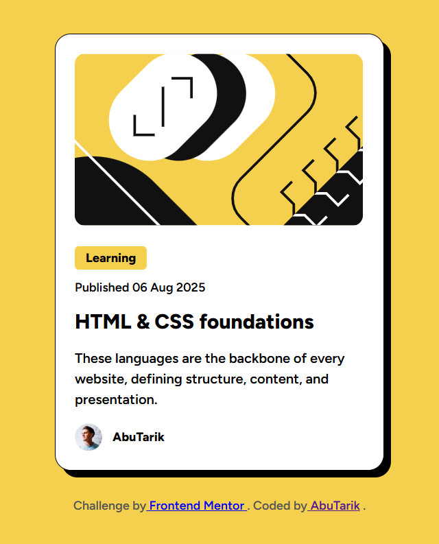

# Frontend Mentor - Blog preview card solution

This is a solution to the [Blog preview card challenge on Frontend Mentor](https://www.frontendmentor.io/challenges/blog-preview-card-ckPaj01IcS). Frontend Mentor challenges help you improve your coding skills by building realistic projects.

## Table of contents

- [Overview](#overview)
  - [The challenge](#the-challenge)
  - [Screenshot](#screenshot)
  - [Links](#links)
- [My process](#my-process)
  - [Built with](#built-with)
  - [What I learned](#what-i-learned)
  - [Continued development](#continued-development)
  - [Useful resources](#useful-resources)
- [Author](#author)

## Overview

### The challenge

Users should be able to:

- See hover and focus states for all interactive elements on the page

### Screenshot



### Links

- Solution URL: (https://github.com/AbuTarik/Blog-preview-card)
- Live Site URL: (https://abutarik.github.io/Blog-preview-card/)

## My process

### Built with

- Semantic HTML5 markup
- CSS custom properties
- Flexbox
- CSS Grid
- Mobile-first workflow

### What I learned

During this project, I gained a better understanding of how to create visually appealing card components using CSS. I learned how to use properties like box-shadow to add depth, transition to create smooth hover effects, and gap to space out elements within flex containers. These techniques helped me build a clean and interactive design that enhances user experience

To see how you can add code snippets, see below:

```css
.proud-of-this-css {
  box-shadow: 0.8rem 1rem black;
  transition: 0.2s;
  gap: 0.75rem;
}
```

### Continued development

In future projects, I aim to deepen my skills in HTML, CSS, and JavaScript, especially focusing on writing clean, accessible, and scalable code. I also plan to improve my frontend development abilities by exploring frameworks like React or Vue. On the backend side, I want to gain more experience with Node.js, Express, and databases like MongoDB or SQL. My long-term goal is to become a Full Stack Developer, capable of building complete, efficient, and responsive web applications from start to finish.

### Useful resources

- [CSS Flexbox](https://flexbox.malven.co/) - This interactive guide helped me better understand how Flexbox works, especially in aligning and distributing space within containers. I found the visual examples very effective, and I plan to use Flexbox more confidently in future layouts.

## Author

- Website - [AbuTarik](https://abutarik.github.io/link-in-bio/)
- Frontend Mentor - [@AbuTarik](https://www.frontendmentor.io/profile/AbuTarik)
- X - [@AbuTareq_xd](https://x.com/AbuTareq_xd)
